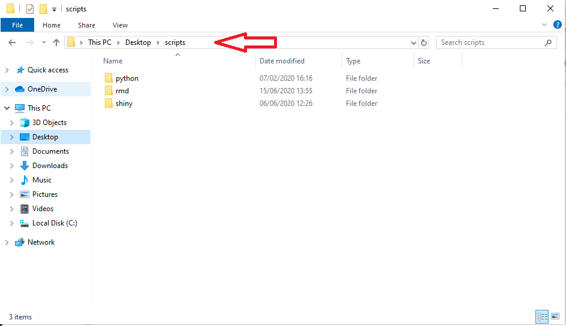
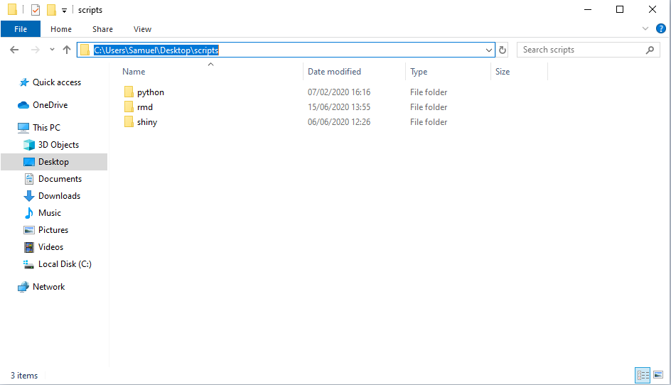
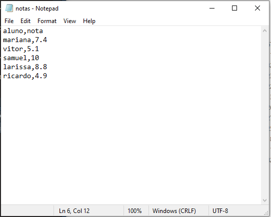

## Estruturas Básicas

### Vetor

Um vetor é um conjunto de valores atribuidos à uma variável. Para criar um vetor, utiliza-se o comando `c()`.

Exemplos de vetores:
```{r}
vetor1 <- c(1, 1, 2, 3, 5, 8)
idades <- c(17, 20, 22, 18, 30)
alunos <- c("Ricardo", "Samuel", "Vitor", "Ellen", "Mariana")
vetor2 <- c(0, vetor1, 0)

```

Existem funções que permitem criar e manipular vetores com características com maior facilidade, a seguir, estão algumas delas:


**Sequências**

Para criar um vetor baseado em uma sequência, pode-se usar a função `seq()`, que cria um vetor do valor A até o valor Z.

Exemplos:

```{r }
# Criar um vetor de 1 a 10
vetor1 <- seq(from = 1, to = 10)
vetor1

#outra forma de criar o vetor de 1 a 10
vetor1.1 <- 1:10
```

Perceba que, por padrão, o intervalo entre os números gerados é 1. Porém, também pode-se alterar a distância entre os elementos ( ou a "distância de passos"), com o argumento `by = N`, e a quantidade de elementos criados, com o argumento `length.out = N`.

Exemplos:

```{r} 
# Criar vetor de 1 a 10, com tamanho do passo = 2
vetor2 <- seq(from = 1, to = 10, by = 2)
vetor2

# Criar vetor de 1 a 10, com 4 elementos
vetor3 <- seq(from = 1, to = 10, length.out = 4)
vetor3

```

**Operações em vetores**

É possível aplicar uma série de operações em vetores, a seguir, algumas das operações mais utilizadas:

- `length(x)`: número de elementos do vetor x
- `sum(x)`: soma dos elementos do vetor x
- `prod(x)`: produto dos elementos do vetor x
- `max(x)`: seleciona o maior elemento do vetor x
- `min(x)`: seleciona o menor elemento do vetor x
- `range(x)`: retorna o menor e o maior elemento do vetor x

**Criando vetores com a função `paste`**

É possível também manipular vetores "colando" partes com a função `paste`.

Pode-se usá-lo para adicionar tanto um prefixo quanto um sufixo, usando as seguintes sintaxes:

- Prefixo: `paste("prefixo", vetor, sep = "separador")`
- Sufixo: `paste(vetor, "sufixo", sep = "separador")`

Exemplos:

```{r }
x <- 1:10
# adicionando o prefixo "número", separando com "_"
paste("número", x, sep = "_")


# adicionando sufixo e atribuindo o resultado à variavel "y"
y <- c(paste(11:20, "número", sep = "%"))
y

```

Caso deseja-se adicionar um elemento "grudado" ao valor, pode-se tanto usar o argumento `sep=""` dentro da função `paste`, como a função `paste0`.

Exemplo:

```{r}
# usando sep = ""
z <- c(paste("numero", 21:30, sep = ""))
z

#usando paste0
w <- c(paste0("numero", 21:30))
w
```

**Repetições**

É possível repetir um elemento ou um vetor com a função `rep()`. A seguir, alguns dos argumentos mais utilizados dentro da função:

- `times`: define o número de vezes que o número ou vetor inteiro será repetido
- `each`: define o número de vezes que cada elemento em um vetor será repetido
- `length.out`: define o tamanho do vetor de saída

Exemplos:

```{r}
# repetindo um número 10 vezes
r1 <- rep(5, times = 10) # ou somente rep(5,10)
r1

x <- c("a", "b", "c")

# repetindo o vetor inteiro 5 vezes
rep(x, times = 5)

# repetindo cada elemento do vetor 5 vezes
rep(x, each = 5)

# criando um vetor de tamnaho 7
rep(x, length.out = 7)

```

**Selecionando um elemento no vetor**

Caso deseja-se saber qual o elemento se encontra em uma determinada posição de um vetor, denotada por *i*, pode-se localizá-lo utilizando a sintaxe `vetor[i]`

Vale ressaltar que a contagem é iniciada a partir do valor 1, diferente de certas linguagens de programação em que a contagem começa na posição 0.

Exemplo:

```{r}
# localizando o décimo terceiro número par entre 10 e 50
valores <- seq(10, 50, by = 2)
valores[13]

```

### Matriz

Uma matriz é uma generalização de um vetor, tendo duas dimensões (linhas e colunas). Podemos pensar em um vetor como uma matriz com uma de suas dimensões igual a 1.
A sintaxe é dada abaixo, em que "L"é o número de linhas, "C"é o número de colunas e se "Q"= 1
ativa disposição por linhas, se "Q"= 0 mantém disposição por colunas (ou T ou F).


`x <- matrix(data = dados, nrow = L, ncol = C, byrow = Q) `

Exemplos:

```{r}
# Criando uma matriz de 2 linhas, 5 colunas e disposição por linhas

ml <- matrix(data = c(1:10), nrow = 2, ncol = 5, byrow = 1)
ml

# Criando uma matriz de 2 linhas, 5 colunas e dispoção por colunas:
mc <- matrix(data = c(1:10), nrow = 2, ncol = 5, byrow = 0)
mc
```


**Selecionando elemento da matriz**

Para selecionar um elemento de uma matriz utilizamos a indexação por colchetes na variável que
representa a matriz com os índices separados por vírgula.

 
Exemplos: 
```{r}
# Selecionando a linha 2 e coluna 4 da matriz ml
ml[2,4]

# Selecionando a linha 2 da matriz ml
ml[2,]

# Selecionando as colunas 2,3 e 4 da matriz ml
ml[,2:4]

# Outra forma de ler a matriz ml
ml[,]
```


**Operações de matrizes**

-`A*B`: Produto elemento a elemento de A e B
-`A% * &B`: Produto matricial de A por B
-`apern(A)`: Matriz transposta de A
-`t(A)`: Matriz transposta de A
-`solve(A)`: Matriz inversa de A
-`solve(A,B)`: Resolve o sistema linear Ax = B
-`det(A)`: Retorna o determinante de A
-`diag(v)`: Retorna uma matriz diagonal onde o vetor v é a diagonal
-`diag(A)`: Retorna um vetor que é a diagonal de A
-`diag(n)`: Sendo n um inteiro, retorna uma matriz identidade de ordem n
-`eigen(A)`: Retorna os autovalores e autovetores de A

### Array

Um array é uma generalização de uma matriz, em que os dados podem ser distribuidos em n
dimensões de tamanhos t<sub>i</sub>, i  E {1, 2, ..., n}. A sintaxe utilizada é dada abaixo, em que "dim"é um vetor de dimensão do array.

`x <- array(data = dados,dim = c())`

Exemplos:
```{r}
# Criando um array com dimensão de linhas e 5 colunas
a <- array(data = c(1:10), dim = c(2,5))
a


# Criando um array de 3 dimensões
b <- array(1:18, dim = c(2,3,3))
b
```

*Selecionar um elemento do array*
O acesso dos elementos de um array é análogo ao de matriz e vetor, diferenciando no fato de que
são informados n campos, considerando que são n dimensõos.

Exemplo:
```{r}
# Acessando um elemento do array b do exemplo anterior
b[1,2,3]
```

### Lista

Listas são estruturas genéricas e flexíveis que permitem armazenar diversos formatos em um único
objeto.


`list(elemento1, elemento2, elementon)`

Exemplos: 
```{r}
# Criando vetores *s, **b*, e formando uma lista com esses vetores
s <- c("aa", "bb", "cc", "dd", "ee")
b <- c(TRUE, FALSE, TRUE, FALSE, FALSE)
x <- list(s, b, 3)
x
```

*Operações com membros da lista*

Para operações com membros da lista utiliza-se a sintaxe `lista[]`. A seguir, alguns exemplos utilizando a lista criada no exemplo anterior:

```{r}
# Imprimindo o segundo membro da lista x:
x[2]


# Imprimindo o segundo e o terceiro membro da lista x

x[c(2,3)]
```


*Operações com elementos dos membros da lista*

Também pode-se realizar operações com elementos dentro de um membro da lista. Para isso, utiliza-se a seguinte sintaxe:

`lista[[membro]][elemento]`

Exemplos: 
```{r}
# Imprimindo o terceiro elemento do segundo membro da lista x

x[[2]][3]
```

### Data Frame

O data-frame é uma estrutura semelhante à uma matriz porém com cada coluna sendo tratada separadamente. Desta forma podemos ter colunas de valores numéricos e colunas de caracteres no mesmo objeto. 

Dentro da mesma coluna todos elementos tem que ser do mesmo tipo. Cada vetor (coluna) tem que ter o mesmo número de observações. 

A sintaxe é dada da seguinte forma:

`data.frame(elemento1 = x1,..., elementoN = xn)`

Exemplo:
```{r}
n <- c(2, 3, 5)
s <- c(" aa ", " bb ", " cc ")
b <- c(TRUE, FALSE , TRUE)
t <- c(paste0("H" ,1:3) )

# Criando um data-frame df com elementos(vetores) n, s, b e t
df <- data.frame(n, s, b, t)
df
```

Pode-se alterar tanto o nome das linhas como o nome das colunas de um data frame, utilizando as funções `row.names()` e `col.names()`, respectivamente.


Exemplos:

```{r}
# Dando nome as linhas do data-frame df
row.names(df) <- c("linha1","linha2","linha3")
df
```

É possível selecionar um determinado elemento dentro de um data frame, selecionando uma linha e coluna especifica de duas formas diferentes:

```{r}
# Selecionando observação da primeira linha e segunda coluna do data-frame
df[1,2]


# Outra forma de selecionar a observação da primeira linha e segunda coluna do data-frame
df["linha1", "s"]
```

De forma análoga, pode-se selecionar uma coluna inteira de um data frame. pode-se imprimir o output de duas formas: como um vetor e como coluna de um data frame.

Exemplos de output como vetor:

```{r}
# Duas formas de imprimir um vetor com os elementos da terceira coluna
df[[3]]
df[["b"]]

# Outras formas de imprimir um vetor com elementos da terceira coluna
df$b
df[,"b"]
df[,3]
```

Exemplos de output como coluna:

```{r}
# Imprimir apenas a terceira coluna
df[3]
df["b"]


# Imprimir apenas a segunda e a terceira coluna
df[c("b", "s")]
```


Também é possível selecionar uma linha especifica de um data frame. Neste caso, o R retornará na mesma estrutura do data-frame apenas a linha específica.

Sintaxe:

`dataframe[linha,]`

Exemplos: 

```{r}
# Imprimir apenas a segunda linha
df[2,]
df['linha2',]

# Imprimir apenas a segunda e a terceira linha
df[c(2,3),]
df[c("linha2", "linha3"),]
```


## Tabelas

Uma das formas de se visualizar facilmente os dados é por meio de tabelas, permitindo um olhar mais amplo e claro de um conjunto de informações.

### Tabelas Simples

Para criar uma tabela simples de uma variavel, utiliza-se a função `table(variavel)`.

Exemplo:
```{r}
# criando uma tabela simples para a variavel "sexo"
sexo <- c("F", "F", "F", "M", "M")
table(sexo)

# criando uma tablea simples para a variavel "turma"
turma <- c(rep("A", 2), rep("B", 3))
table(turma)
```

### Tabelas de Contingência

Uma tabela de contingência é usada quando se deseja cruzar informações sobre duas variáveis.

A sintaxe utilizada é semelhante à anterior: `table(variavel1, variavel2)`

Exemplo:
```{r}
# criando uma tabela de contingência para as variáveis "sexo" e "turma"
table(sexo, turma)
```

*Observação:* Para criar uma tabela de contingência com duas variáveis é necessário que ambas tenham o mesmo número de elementos.

### Tabelas de Proporção

Quando é de interesse obter a frequência relativa das variáveis de uma tabela de contingência, utiliza-se a tabela de proporção, usando a seguinte sintaxe:

`prop.table(X = tabela, margin = ...)`

*Observação:* Para utilizar a função acima, é necessário que a tabela de contingência da qual se deseja obter as frequências já tenha sido criada anteriormente e atribuida à um objeto.

A opção `margin = ` indica qual a marginal será utilizada na tabela, seguindo a seguinte ordem:

- `NULL`: proporção total 
- `1`: proporção por linha
- `2`: proporção por coluna

Exemplo:

```{r}
#atribuindo a tabela ao elemento "tabela"
tabela <- table(sexo, turma)

# calculando a proporção total para a tabela anterior
# prop.table(tabela) ou
prop.table(tabela, margin = NULL) 

# calculando a proporção por linha
prop.table(tabela, margin = 1) 

```


## Funções

Funções são sequências de código definidas pelo usuário para executar uma sequência específica de comandos. É possível escrever funções no R através da seguinte sintaxe:

```{r sintaxe_funcoes, eval = FALSE}
funcao <- function(argumento1, argumento2, ...)
{
  sequencia de código utilizando os argumentos
}
```

Exemplos:

```{r exemplo_funcoes_1}
# Criando uma função para elevar um argumento x ao quadrado
fx <- function(x){x^2}
fx(2)
```

```{r exemplo_funcoes_2}
y <- 1:10 # Criando um vetor com a sequencia de 1 a 10
fx(y)
```

```{r}
x <- matrix(1:15, nrow=5, ncol=3) # Criando uma matriz 3x5
fx(x)
```

## Funções Apply

Funções da família apply são utilizadas para se aplicar outras funções em diferentes tipos de estruturas de dados,
a aplicação das funções nessas estruturas é feita de forma iterativa, sem a necessidade de usar loops (como `while` ou `for`).
Diferentes funções apply são usadas para diferentes estruturas de dados.

### Apply

A função `apply` é utilizada em matrizes, --data frames-- ou arrays. Ela retorna um vetor ou array dos valores obtidos aplicando a função argumento nos dados, sendo utilizada da seguinte forma:

```{r apply_demonstracao, eval = FALSE}
apply(X, Margem, Funcao)
```

Onde `X` representa os dados (array, matriz ou data.frame), `Margem` representa a margem que será utilizada na iteração (sendo `1` para linha, `2` para coluna), e `Funcao` representa a função a ser aplicada.

Exemplos:

```{r exemplo_apply_1}
matriz <- matrix(1:16, 4, 4) # Criando uma matriz 4x4
matriz # Visualizando a matriz
```

Abaixo aplicamos a função `sum` (terceiro argumento) ao objeto `matriz` (primeiro argumento), na primeira marginal (segundo argumento), desta forma, a função `apply` retorna um vetor com as somas de cada linha da matriz.

```{r}
apply(matriz, 1, sum)
```

Abaixo, usamos o segundo argumento como `2`, assim, a função retorna um vetor com as somas das colunas da matriz.

```{r}
apply(matriz, 2, sum)
```

Também é possível utilizar funções criadas por usuários ou funções de outros pacotes.

Exemplo:

```{r}
apply(matriz, 1, function(x){x^2+0.5})
```

### Tapply

A função `tapply` funciona da mesma forma que a função `apply`, mas podendo usar uma variável como indice de marginal.
A função é utilizada da seguinte forma:

```{r tapply_demonstracao, eval = FALSE}
tapply(X, Indice, Funcao)
```

Exemplo:

```{r exemplo_tapply}
dados <- data.frame(sexo = rep(c("M", "F"),
                               c(9, 11)),
                    idade = c(79, 2, 95, 22, 25, 73, 82, 23, 6, 19,
                              43, 39, 9, 88, 89, 41, 4, 13, 92, 33))

# Calculando a méria da idade de acordo com sexo
tapply(dados$idade, dados$sexo, mean)
```

### Sapply

A função `sapply` é utilizada para aplicar funções em cada elemento de um objeto de tipo lista, utilizando a seguinte sintaxe:

```{r sapply_demonstracao, eval = FALSE}
sapply(X, Funcao)
```

Onde `X` representa os dados (de tipo lista) e `Funcao` representa a função a ser aplicada em cada elemento dessa lista.

Exemplo:

Abaixo a função sapply retorna um vetor de comprimento `3`, onde cada elemento representa o resultado da função `mean` de cada elemento da lista.

```{r exemplo_sapply}
x <- 1:10 # Criado um vetor de sequencia de 1 a 10
y <- 2:14 # Criado um vetor de sequencia de 2 a 14
z <- 60:90 # Criado um vetor de sequencia de 60 a 90

lista <- list(x,y,z) # Criando uma lista com os objetos anteriores

sapply(lista, mean) 
```

### Lapply

A função `lapply` funciona da mesma forma que `sapply`, porém, é retornado uma lista ao invés de um vetor dos resultados. A função é utilizada da seguinte forma:

```{r lapply_demonstracao, eval = FALSE}
lapply(X, Funcao)
```

Onde `X` representa os dados (de tipo lista) e `Funcao` representa a função a ser aplicada em cada elemento dessa lista.

Exemplo:

Abaixo a função lapply retorna uma lista de comprimento `3`, onde cada elemento representa o resultado da função `mean` de cada elemento da lista.

```{r exemplo_lapply}
x <- 1:10 # Criado um vetor de sequencia de 1 a 10
y <- 2:14 # Criado um vetor de sequencia de 2 a 14
z <- 60:90 # Criado um vetor de sequencia de 60 a 90

lista <- list(x,y,z) # Criando uma lista com os objetos anteriores

lapply(lista, mean) 
```
## Pacotes

Como o R é **opensource**, a comunidade pode desenvolver e implementar novas funcionalidades que não estão presentes no pacote básico do R, chamadas de pacotes.

Os pacotes podem ser disponibilizados online e baixados pelos usuários dentro do programa, através da função `install.packages("nome do pacote")`.

Após baixar o pacote, é necessário carregá-lo para poder utilizar suas funcionalidades. Para isso, pode-se utilizar duas sintaxes:

`library(nome do pacote)` ou `require(nome do pacote)`

*Observação:* Para baixar o pacote é necessário que o nome esteja entre aspas, o que não é preciso para carregá-lo.

Exemplo:

```{r, eval = FALSE}
#baixando e carregando o pacote gráfico ggplot2
install.packages("ggplot2")
library(ggplot2)
```

## Entrada de Dados

No que se refere à leitura de dados, existem meios para a leitura de bancos de dados externos, bem como carregar bancos disponíveis no próprio R.

Para carregar bancos de dados externos, primeiro é necessário definir qual será o local (pasta) de trabalho. Para isso, usa-se:

`setwd("C:\\Usuário\\Local")`

*Observação:* Note que é preciso utilizar aspas para indicar o local e também barras duplas (`\\`) ou barras invertidas (/) para separação.

No Windows, para encontrar o "caminho" da pasta que desja, basta clicar no local indicado na figura a seguir:

```{r, echo = F}



```

Para verificar qual o local que está definido como pasta de trabalho, utiliza-se a função `getwd()`.

### .csv ou .txt

Para ler arquivos do tipo `.csv`(excel) ou `.txt`, pode-se utilizar a função `read.table("dados.csv, ...)`, se atentando para os seguintes detalhes dentro da função:

- `header`: indica se há ou não cabeçalho dentro do banco de dados
- `sep`: indica qual o separador entre as células do banco (indicada entre aspas)
- `dec`: indica qual o indicador decimal das unidades numéricas do banco (indicada entre aspas)

A seguir, vamos ler o banco de dados `notas.txt` como exemplo:

```{r, echo = F}

```

Após definir o local de trabalho, verifica-se que o banco de dados possui cabeçalho, está com os elementos separados por vírgulas, e usa como separador decimal o ponto, com isso, temos:

```{r, echo = F}
notas <- read.table("data/notas.txt", header = T, sep = ",", dec = ".")
notas
```

*Observação:* Para arquivos `.csv`, geralmente são utilizados dois separadores: `,` e `;`.

*Observação:* Para a melhor leitura de arquivos do excel do tipo `.xls` ou `.xlsx` é necessário o uso de pacotes.

### Leitura de dados da internet

Também é possível ler arquivos da Web, indicando o endereço (URL) dentro da faunção.

Exemplo:
```{r}
# lendo um banco de dados da Web sobre gatos dosméticos
gatos <- read.table("https://vincentarelbundock.github.io/Rdatasets/csv/boot/catsM.csv", sep = ",", header = T)
```


### Base de dados do R

O R base já vem com alguns bancos de dados que são usados para aprendizado ou exemplificação.

Para ver todas as opções disponíveis utiliza-se a função `data()`.

Para utilizá-los basta atribuirmos o nome do banco escolhido a algum objeto, ou usando pelo próprio nome no R.

```{r}
# lendo o banco de dados iris
data(iris)
```

### Conferência dos dados

É recomendável conferir a importação dos dados para evitar erros futuros na análise. Existem comandos utilizados para isso, tais como:

- `head()`: imprime as primeiras observações de um banco de dados
- `tail()`: imprime as últimas observações de um banco de dados
- `View()`: mostra todo o banco de dados em outra janela
- `str()`: imprime o tipo e dimensão de cada variável do banco de dados

Exemplo:

```{r}
# mostrando as primeiras linhas do banco 'iris'
head(iris)

# mostrando as 3 primeiras linhas do banco 'iris'
head(iris, 3)

# mostrando as últimas linhas do banco 'gatos'
tail(gatos)

#mostrando as variáveis do banco 'gatos'
str(gatos)
```

### Funções Adicionais

É possível facilitar o acesso às colunas de uma base de dados, isto é, ao invés de utilizar o operador $ para acessar alguma coluna pode-se utilizar o seu próprio nome. Para fazer isso, utiliza-se o comando `attach(dados)`.

Esse comando irá trazer para a memória do computador cada coluna como um objeto, logo não é recomendável fazer isso com tanta frequência e com uma quantidade grande de dados. Para desfazer esse anexo de dados na memória, usa-se `detach(dados)`.

# Estatística Básica

## Medida de posição

As medidas descritivas são úteis para a representação dos dados a serem trabalhados e normalmente precedem qualquer análise estatística.

### Média 

Para se calcular a média de um conjunto de dados utiliza-se a função `mean()`.

Exemplo :

```
{r}
x <- 1:11
mean(x)
```

### Mediana

Para se calcular mediana de um conjunto de dados utiliza-se a função `median()`.

Exemplo:

```
{r}
x <- 11:20
median(x)
```

### Mínimo e máximo

Assim como quase tudo no R, existe mais de uma maneira de se calcular o mínimo e o máximo em um conjunto de dados. A primeira maneira é utilizando as funções `min()` e `max()`.

Exemplo:

```
{r}
x <- 1:100
min(x)

max(x)
```


A outra forma é utilizando a função `range()`, mas neste caso o R retornará um vetor de 2 posições, sendo o mínimo representado pelo primeiro elemento e o máximo pelo segundo.

Exemplo:

```
{r}
x <- 1:100
range(x)
```

### Quantis

Para se obter os quantis de um conjunto de dados utiliza-se a função `quantiles()`.

É possível indicar quais são os quantis de interesse dentro da função. Por padrão, a função retorna os quantis de 0%, 25%, 50%, 75% e 100%, mas é possível achar os qualquer quantil de interesse em uma sequência de valores.

Exemplo:

```
{r}
x <- 1:11 + c(rep(1.2,4),rep(2.3,5),rep(4.3,2))
quantile(x)

quantile(x,c(.05,.95))
```

### Moda

No R base não existe uma função específica para se calcular a moda, isto é, o valor mais frequente no conjunto. Então, uma sugestão para se verificar esse valor mais frequente é criar uma tabela de frequência através do comando `table()`, visto anteriormente, e investigar nessa tabela o valor que mais se repete.

*Observação 1*: Note que este método só é válido para dados de natureza quantitativa discreta.
*Observação 2*: Utiliza-se a função `which.max()` para retornar a posição da tabela com o máximo da frequência.

Exemplo:

```
{r}
x=c(2,1,2,2,1,4,4,5,2,6,5,3,2,4,1,6)
tb=table(x)
tb
which.max(tb)
```

### Função Summary

A função `summary()` é uma função genérica dentro do R que, quando a aplicada a objetos da classe de vetor numérico, retorna algumas medidas de posição.

Exemplo:

```
{r}
x=c(1.3,1.5,1.3,1.7,1.9,2,1.4)
summary(x)
```


## Medidas de Dispersão

### Variância

Uma medida muito importante para se entender o comportamento dos dados é a variância, calculada através da fórmula `var(dados)`.

Exemplo:

```{r}
x <- c(1, 3.5, 7, 5.4, 10)
var(x)
```

### Desvio Padrão

Sabendo que o desvio padrão é a raiz quadrada da variância, é possível achá-lo aplicando a função de raiz quadrada, vista nas sessões anteriores, na função de variância. A sintaxe fica da seguinte forma: `sqrt(var(x))`.

Uma outra forma de se calcular o desvio padrão é utilizando a função `sd(dados)`.

Exemplo:
```{r}
x <- c(1, 3.5, 7, 5.4, 10)

# calculando o desvio padrão atráves da raiz da variância
sqrt(var(x))

# calculando o desvio padrão através da função sd
sd(x)
```

### Coeficiente de Variação

Para se ter uma métrica da variabilidade relativa dos dados é interessante vermos o coeficiente de variação, dada pela divisão do desvio padrão pela média vezes 100. Escrevendo essa fórmula no R obtém-se a seguinte sintaxe:

`(sd(dados)/mean(dados)) *100`

Exemplo:

```{r}
# calculando o coeficiente de variação para o vetor anterior
(sd(x)/mean(x)) *100
```

### Amplitude

Para se calcular a amplitude basta subtrair o valor mínimo do máximo presente no conjunto de dados.

Exemplo:

```{r}
# calculando a amplitude do vetor anterior
amp <- max(x) - min(x)
amp
```

## Correlação

Quando tratamos de variáveis quantitativas, principalmente contínuas, é interessante ter uma medida explicativa a respeito da quantidade de variabilidade compartilhada entre duas variáveis. Essa medida é usualmente o coeficiente de correlação, um valor entre -1 e 1 que explica a força (proximidade de |1|) e direção (positiva ou negativa) da correlação.

Há 3 abordagens diferentes para se calcular essa medida(Pearson, Kendall e Spearman). Em todos os casos, utiliza-se a função `cor()`.

*Observação:* Caso não seja especificado na função qual método será utilizado, é aplicado o método de pearson.

### Coeficiente de Pearson

Para se calcular o coeficiente de Pearson usa-se o comando `cor(..., method = "pearson")`

````{r}
v1 <- c()
v2 <- c()

cor(v1, v2, method = "pearson")
```

### Coeficiente de Kendall

Para se calcular o coeficiente de Kendall usa-se o comando `cor(..., method = "kendall")`

````{r}
v1 <- c()
v2 <- c()

cor(v1, v2, method = "kendall")
```

### Coeficiente de Spearman

Para se calcular o coeficiente de Spearman usa-se o comando `cor(..., method = "spearman")`

````{r}
v1 <- c()
v2 <- c()

cor(v1, v2, method = "Spearman")
```


